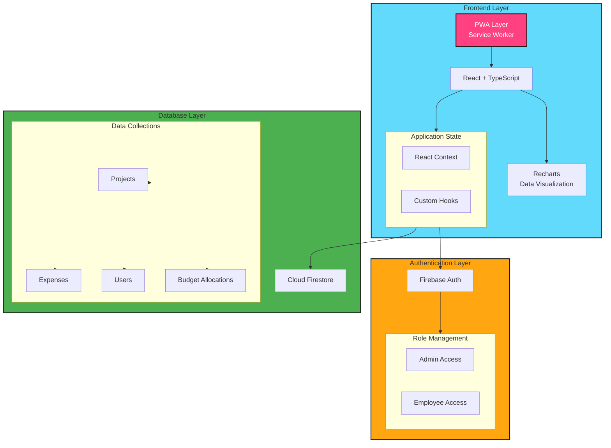

# HomeSquare Expense: Enterprise Project Management & Expense Tracking

## 🔗 Live Demo
[Live Application](https://homesquareinternal.netlify.app/)

### Demo Credentials
1. **Admin View**
   - Email: dvigneshkumar3@gmail.com
   - Password: home_square
2. **Employee View**
   - Email: dvigneshkumar99@gmail.com
   - Password: home_square

## 📑 Table of Contents
- [Overview](#overview)
- [Architecture](#architecture)
- [Features](#features)
- [Tech Stack](#tech-stack)
- [Screenshots](#screenshots)
- [Installation](#installation)
- [PWA Features](#pwa-features)
- [Contributing](#contributing)

## 🎯 Overview
HomeSquare Expense is an enterprise-grade project expense management system that enables organizations to efficiently track project budgets, allocate funds, and monitor expenses. Built with scalability and user experience in mind, it provides real-time insights through interactive visualizations and supports both admin and employee workflows.

## 🏗️ Architecture

## 🚀 Features

### Project Management
- Create and manage multiple projects
- Set and adjust project budgets
- Track project timeline and status
- Real-time budget utilization monitoring

### Budget Allocation
- Allocate funds to team members
- Track allocation history
- Monitor spending limits
- Real-time balance updates

### Expense Tracking
- Add and categorize expenses
- Tag expenses to specific projects
- Upload receipt documentation
- Track expense history

### Analytics & Reporting
- Interactive charts and graphs
- Project profit visualization
- Budget utilization trends
- Custom report generation

## 🛠️ Tech Stack
- 
- 
- 
- 

## 📸 Screenshots
[Placeholder for Screenshots]
- Dashboard Overview
- Project Management Interface
- Expense Entry Form
- Analytics Dashboard
- Budget Allocation Interface

## ⚙️ Installation

### Prerequisites
- Node.js >= 14.x
- npm >= 6.x
- Firebase account

### Local Development
```bash
# Clone the repository
git clone [repository-url]

# Install dependencies
npm install

# Set up environment variables
cp .env.example .env
# Add your Firebase configuration to .env

# Start development server
npm start
```
### Environment Configuration
Required environment variables:
- REACT_APP_FIREBASE_API_KEY
- REACT_APP_FIREBASE_AUTH_DOMAIN
- REACT_APP_FIREBASE_PROJECT_ID
- REACT_APP_FIREBASE_STORAGE_BUCKET
- REACT_APP_FIREBASE_MESSAGING_SENDER_ID
- REACT_APP_FIREBASE_APP_ID

## 📱 PWA Features
- Responsive design for all device sizes
- Progressive Web App capabilities
- Offline support (Coming Soon)
- Custom offline page with service worker implementation
- Install to home screen functionality

## 🌟 Key Technical Features
- TypeScript for enhanced type safety
- Real-time data synchronization
- Role-based access control
- Responsive design implementation
- Scalable architecture
- Comprehensive error handling
- Performance optimized charts
- Secure authentication flow

## 🤝 Contributing
This is an open-source project and contributions are welcome. Please follow these steps:
1. Fork the repository
2. Create your feature branch
3. Commit your changes
4. Push to the branch
5. Create a Pull Request

## 📝 License
[MIT](LICENSE)
